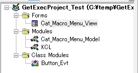

# ***CATIA_V5_SimpleMacroMenu***
This is a macro(CATVBA) for "CATIA V5".

Form buttons for calling macros created for each module are created dynamically.
***

## Installation:
Create a new VBA project and put the following files in the same project.
(Drag&Drop is OK)

・Cat_Macro_Menu_Model.bas
・Cat_Macro_Menu_View.frm
・Cat_Macro_Menu_View.frx
・Button_Evt.cls
・KCL.bas



## Usage:
This macro only supports macro invocation. You need the macro you created.

To create a form button dynamically, the following conditions are required.

In order to generate buttons dynamically, it is necessary to write information "tags" in the declaration section of the VBA module.

## Tags:
### 〇Tags position
Write a comment between the beginning of the module and the first function.
In the example below, it is the position before "Option Explicit".
```
'vba sample_Part2Product_ver0.0.3  using-'KCL0.0.12'  by Kantoku
'PartからProduct化します
'ﾎﾞﾃﾞｨ･形状ｾｯﾄ･時系列形状ｾｯﾄで表示されているもののみ
'(ｽｹｯﾁは対象外)

'{GP:1}
'{Caption:Pt→Pro}
'{ControlTipText:PartからProductに変換します}

Option Explicit

Sub CATMain()
 ・・・
```


### 〇Tags format

The tags format is
```
{Keyword: Value}
```
It is necessary to be in the state of.


### 〇Tags Keyword

Fill in the information needed to create the button dynamically.
###### ・{Gp: value}
  This is essential when creating buttons with group abbreviations.
Specify the value in Long type.

Indicates which tab in the menu to create the button.
It is necessary to match the numerical value of the “GROUP_NUMBER_CAPTION” constant part in the declaration section of the “Cat_Macro_Menu_Model.bas” file.

In the present circumstances,
```
1-Part 11-Assy 21-Draw 51-Other
```
Since it is a setting, please enter any numerical value.
On the other hand, if you have a module file like a library, you probably don't want to create a button. If you do not include the {Gp} tag, it will not be displayed on the menu.

###### ・{Ep: value}
Abbreviation for entry point, the value is a string.
Specify the entry point of each module (the name of the procedure to be executed), but if you save labor, it will be "CATMain".

There is no "CATMain" in the sample macro "sample_IsExists_LeftAxis.bas" and it is in the following state.
```
'vba sample_IsExists_LeftAxis_ver0.0.1  using-'KCL0.0.12'  by Kantoku
'Part内の左手座標系の有無ﾁｪｯｸ

'{Gp:1}
'{Ep:LeftHand}
'{Caption:LeftHandAxis}
'{ControlTipText:Part内の左手座標系の有無ﾁｪｯｸ}
'{BackColor:33023}
Option Explicit

Sub LeftHand()
    'ﾄﾞｷｭﾒﾝﾄのﾁｪｯｸ
    If Not CanExecute("PartDocument") Then Exit Sub
・・・
```
It is {Ep: LeftHand}, and "LeftHand ()" will be executed when the button is pressed.

If the procedure specified by the {Ep} tag cannot be found, "CATMain" will be searched automatically, but if neither is found, no button will be created.

###### ・{CommandButton object properties: value}
You can specify the properties of the CommandButton object, but not everything else. Here are the restrictions.

###### Ignored to maintain layout.
  「Top」「Left」「Height」「Width」

###### Ignored if the property value is an object.
  「Font」「MouseIcon」「Picture」

###### If the property value is a constant, it must be specified as a numeric value, not a constant.
 
It is not necessary to set it, but we recommend setting the following tags.

###### ・{Caption: value} 
  The text displayed on the button, the value is a string.

###### ・{ControlTipText: value}
  The character that is displayed when you move the mouse cursor over the button. The value is a string.

###### ・{BackColor: value}
  The color of the button, the value is a long.


### Action:
Confirmed in the following environment.
+ CATIA V5_6 R2018
+ Windows10 64bit Pro

### License:
MIT
