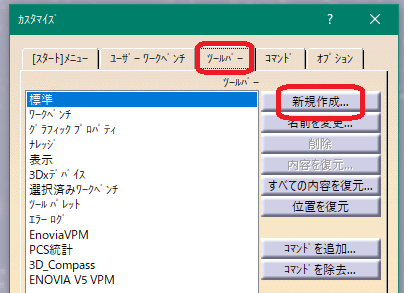

# ***CATIA_V5_SimpleMacroMenu***

"CATIA V5" 用のマクロ(CATVBA)です。

モジュール毎に作成されたマクロを呼び出すためのフォーム ボタンが動的に作成されます。

***

# ・これは何？:
小さなマクロを作成した際、メニューのマクロ部からの呼び出しは面倒です。

又、ツールバーへの登録も数が多い場合は、非常に面倒です。

本マクロは、そのような作業を軽減する事を目的として作成しました。

***

# ・インストール:

+ まずzipファイルをダウンロードし展開します。


+ "catvba_project" フォルダ内にある "CATIA_V5_SimpleMacroMenu.catvba" ファイルを任意の位置にコピペします。その際、任意のファイル名に変更して頂いても大丈夫です。

+ CATIA V5を起動し "ツール" - "マクロ" - "マクロ..." をクリック。 


+ "マクロライブラリー..." - "VBAプロジェクト" - "既存ライブラリーの追加..." で先程の ".catvba" ファイルを選択します。


+ ダイアログの "閉じる" でVBAプロジェクトの登録が終了です。

+ メニューの呼び出しの為に、ツールバーに登録します。"ツール" - "カスタマイズ..." をクリック。
※CATIA V5上で全てファイルを閉じた状態でツールバーの登録を行うと、全てのワークベンチ上で表示されるツールバーとなる為、おススメです。


+ "ツールバー"タブ - "新規作成..." をクリック。お好きな名前を入力して下さい。



+ "コマンド"タブ - "マクロ" にします。"Cat_Macro_Menu_Model" を先程作成したツールバーに、ドラッグ＆ドロップします。　ツールバーに三角のアイコンが表示されますが、味気ない為、"プロパティを表示..." をクリックし "アイコン" クリックし、任意のアイコンに変更した方が良いと思います。


+ "カスタマイズ" ダイアログを閉じ、新たに作成したツールバーのボタンをクリックし小さなダイアログが表示されたら成功です。


***

# 使用法：
このマクロは、マクロの呼び出しのみをサポートします。その為、あなたの作成したマクロが必要です。

メニューにボタンを追加には、VBAモジュールの宣言部に情報「タグ」を記述する必要があります。

以下のリンク先をご覧なると参考になると思います。

[・動作の動画](https://kantoku.hatenablog.com/entry/2017/10/16/183806)

[・追加するマクロ(モジュール)のタグの詳細について](https://kantoku.hatenablog.com/entry/2017/10/17/152746)

[・メニューの設定について](https://kantoku.hatenablog.com/entry/2017/10/19/125107)

***

# タグについて:

## 〇タグの位置

モジュールの先頭と最初の関数の間にコメントを記述します。以下の例では、「Option Explicit」の前の位置です。

```vb
'vba sample_Part2Product_ver0.0.3  using-'KCL0.0.12'  by Kantoku
'PartからProduct化します
'ﾎﾞﾃﾞｨ･形状ｾｯﾄ･時系列形状ｾｯﾄで表示されているもののみ
'(ｽｹｯﾁは対象外)

'{GP:1}
'{Caption:Pt→Pro}
'{ControlTipText:PartからProductに変換します}

Option Explicit

Sub CATMain()
 ・・・
```


## 〇タグフォーマット

タグのフォーマットは
```
{Keyword: Value}
```
の状態である必要があります。


## 〇タグキーワード

ボタンを動的に作成するために必要な情報を入力します。
### ・{Gp:値}
  これは、グループの略語を含むタブを作成する場合に不可欠です。値はLong型で指定してください。

ボタンを作成するメニューのタブを示します。「Cat_Macro_Menu_Model.bas」ファイルの宣言部の「GROUP_NUMBER_CAPTION」定数部分の数値を一致させる必要があります。

現在の状況では、
```
1-Part 11-Assy 21-Draw 51-Other
```
設定ですので、任意の数値を入力してください。一方、ライブラリのようなモジュール ファイルがある場合は、おそらくボタンを作成したくないでしょう。{Gp}タグを含めないとメニューに表示されません。

### ・{Ep:値}
エントリ ポイントの略で、値は文字列です。各モジュールのエントリポイント（実行するプロシージャ名）を指定しますが、手間を省くなら「CATMain」とします。

サンプルマクロ「sample_IsExists_LeftAxis.bas」に「CATMain」がなく、以下の状態です。
```vb
'vba sample_IsExists_LeftAxis_ver0.0.1  using-'KCL0.0.12'  by Kantoku
'Part内の左手座標系の有無ﾁｪｯｸ

'{Gp:1}
'{Ep:LeftHand}
'{Caption:LeftHandAxis}
'{ControlTipText:Part内の左手座標系の有無ﾁｪｯｸ}
'{BackColor:33023}
Option Explicit

Sub LeftHand()
    'ﾄﾞｷｭﾒﾝﾄのﾁｪｯｸ
    If Not CanExecute("PartDocument") Then Exit Sub
・・・
```
{Ep:LeftHand}で、ボタンを押すと「LeftHand()」が実行されます。

{Ep}タグで指定された手順が見つからない場合は「CATMain」を自動検索しますが、どちらも見つからない場合はボタンを作成しません。

### ・{CommandButtonオブジェクトのプロパティ:値}
CommandButton オブジェクトのプロパティを指定できますが、それ以外はすべて指定できません。ここに制限があります。

#### レイアウトを維持するために無視されます。
  「Top」「Left」「Height」「Width」

#### プロパティ値がオブジェクトの場合は無視されます。
  「Font」「MouseIcon」「Picture」

#### プロパティ値が定数の場合、定数ではなく数値として指定する必要があります。
 
設定する必要はありませんが、以下のタグを設定することをお勧めします。

#### ・{キャプション:値}
  ボタンに表示されるテキスト。値は文字列です。

#### ・{ControlTipText:値}
  ボタンの上にマウスカーソルを合わせたときに表示される文字。値は文字列です。

#### ・{BackColor:値}
  ボタンの色、値は long です。

***

# アクション:
以下の環境で確認済みです。
+ CATIA V5_6 R2018
+ Windows10 64bit Pro

***
# ライセンス:
MIT

***

***

***

This is a macro(CATVBA) for "CATIA V5".

Form buttons for calling macros created for each module are created dynamically.
***

## Installation:
Create a new VBA project and put the following files in the same project.
(Drag&Drop is OK)

・Cat_Macro_Menu_Model.bas
・Cat_Macro_Menu_View.frm
・Cat_Macro_Menu_View.frx
・Button_Evt.cls
・KCL.bas


## Usage:
This macro only supports macro invocation. You need the macro you created.

To create a form button dynamically, the following conditions are required.

In order to generate buttons dynamically, it is necessary to write information "tags" in the declaration section of the VBA module.

## Tags:
### 〇Tags position
Write a comment between the beginning of the module and the first function.
In the example below, it is the position before "Option Explicit".
```
'vba sample_Part2Product_ver0.0.3  using-'KCL0.0.12'  by Kantoku
'PartからProduct化します
'ﾎﾞﾃﾞｨ･形状ｾｯﾄ･時系列形状ｾｯﾄで表示されているもののみ
'(ｽｹｯﾁは対象外)

'{GP:1}
'{Caption:Pt→Pro}
'{ControlTipText:PartからProductに変換します}

Option Explicit

Sub CATMain()
 ・・・
```


### 〇Tags format

The tags format is
```
{Keyword: Value}
```
It is necessary to be in the state of.


### 〇Tags Keyword

Fill in the information needed to create the button dynamically.
###### ・{Gp: value}
  This is essential when creating buttons with group abbreviations.
Specify the value in Long type.

Indicates which tab in the menu to create the button.
It is necessary to match the numerical value of the “GROUP_NUMBER_CAPTION” constant part in the declaration section of the “Cat_Macro_Menu_Model.bas” file.

In the present circumstances,
```
1-Part 11-Assy 21-Draw 51-Other
```
Since it is a setting, please enter any numerical value.
On the other hand, if you have a module file like a library, you probably don't want to create a button. If you do not include the {Gp} tag, it will not be displayed on the menu.

###### ・{Ep: value}
Abbreviation for entry point, the value is a string.
Specify the entry point of each module (the name of the procedure to be executed), but if you save labor, it will be "CATMain".

There is no "CATMain" in the sample macro "sample_IsExists_LeftAxis.bas" and it is in the following state.
```
'vba sample_IsExists_LeftAxis_ver0.0.1  using-'KCL0.0.12'  by Kantoku
'Part内の左手座標系の有無ﾁｪｯｸ

'{Gp:1}
'{Ep:LeftHand}
'{Caption:LeftHandAxis}
'{ControlTipText:Part内の左手座標系の有無ﾁｪｯｸ}
'{BackColor:33023}
Option Explicit

Sub LeftHand()
    'ﾄﾞｷｭﾒﾝﾄのﾁｪｯｸ
    If Not CanExecute("PartDocument") Then Exit Sub
・・・
```
It is {Ep: LeftHand}, and "LeftHand ()" will be executed when the button is pressed.

If the procedure specified by the {Ep} tag cannot be found, "CATMain" will be searched automatically, but if neither is found, no button will be created.

###### ・{CommandButton object properties: value}
You can specify the properties of the CommandButton object, but not everything else. Here are the restrictions.

###### Ignored to maintain layout.
  「Top」「Left」「Height」「Width」

###### Ignored if the property value is an object.
  「Font」「MouseIcon」「Picture」

###### If the property value is a constant, it must be specified as a numeric value, not a constant.
 
It is not necessary to set it, but we recommend setting the following tags.

###### ・{Caption: value} 
  The text displayed on the button, the value is a string.

###### ・{ControlTipText: value}
  The character that is displayed when you move the mouse cursor over the button. The value is a string.

###### ・{BackColor: value}
  The color of the button, the value is a long.


### Action:
Confirmed in the following environment.
+ CATIA V5_6 R2018
+ Windows10 64bit Pro

### License:
MIT